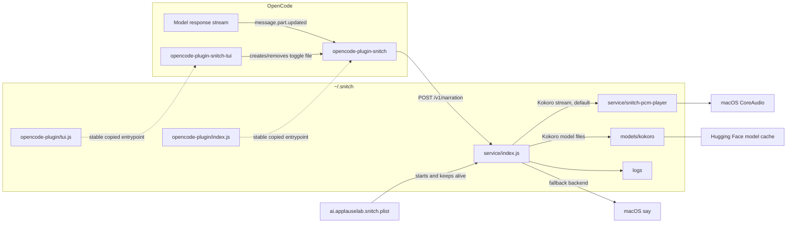
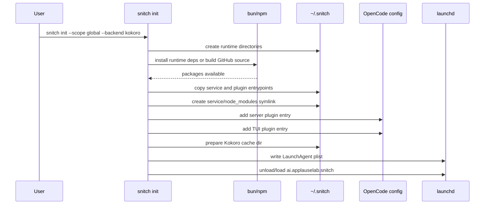
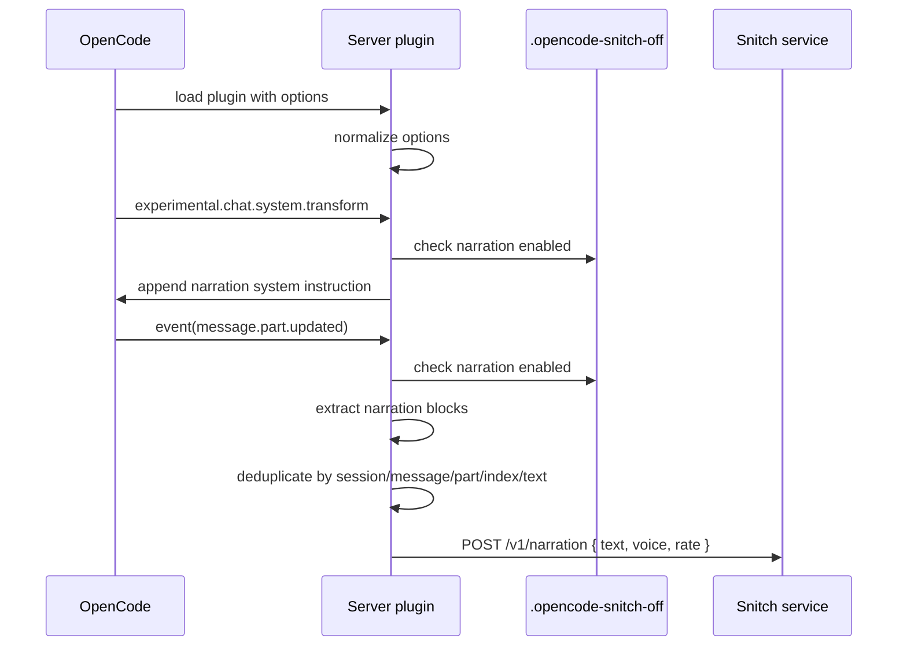
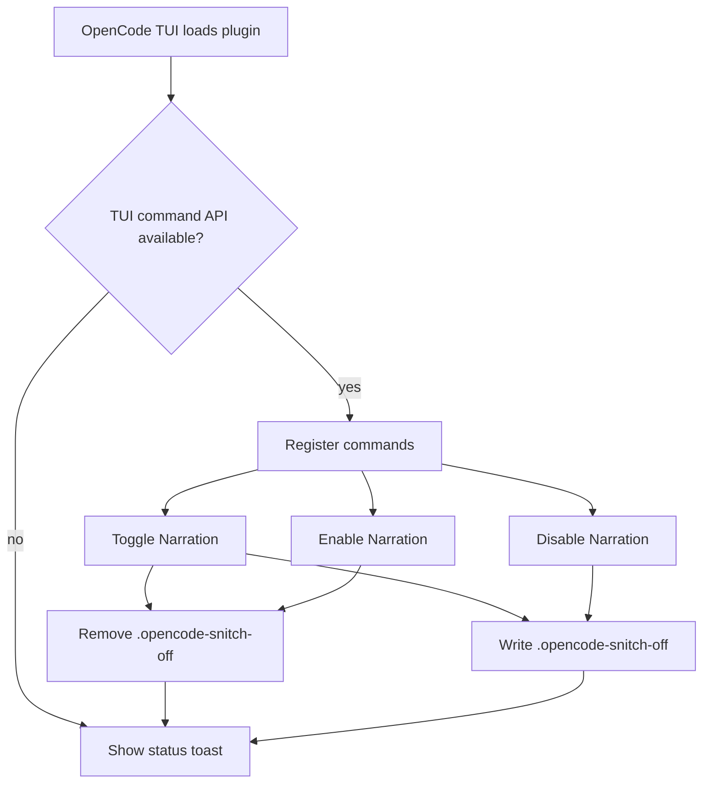
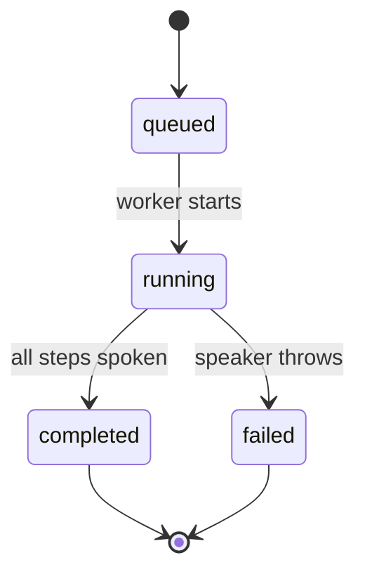
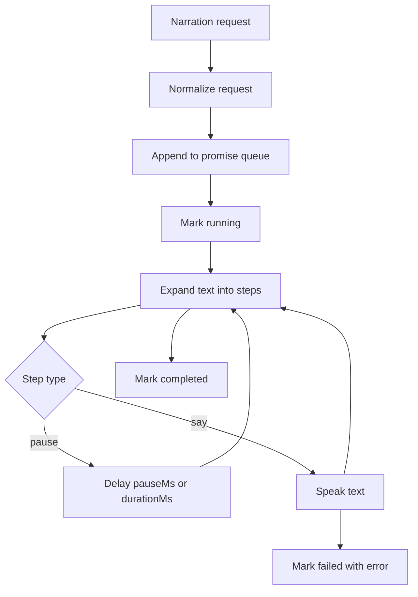
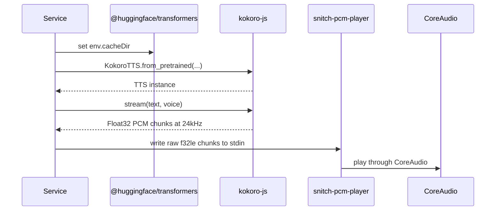

# Snitch Architecture

Snitch turns explicit OpenCode narration blocks into local speech. It has three separable pieces: an OpenCode server plugin, an OpenCode TUI plugin, and a local HTTP speech service managed by launchd.

## System Overview



## Packages

| Package                      | Role                                                                                                                                     |
| ---------------------------- | ---------------------------------------------------------------------------------------------------------------------------------------- |
| `snitch`                     | Installer CLI. Writes OpenCode config, installs runtime packages, materializes stable files, writes LaunchAgent, and starts the service. |
| `snitch-service`             | Local HTTP service and speech queue. Owns `/v1/narration`, `/v1/jobs/:id`, `/health`, and rendering endpoints.                           |
| `opencode-plugin-snitch`     | OpenCode server plugin. Injects narration instructions and extracts narration blocks from assistant text events.                         |
| `opencode-plugin-snitch-tui` | TUI companion package that exposes commands for enabling, disabling, and toggling narration.                                             |

## Install Flow

`snitch init` is intentionally more than a package install. OpenCode config should point at stable files, not transient package-manager internals, so init copies built artifacts into `~/.snitch`.



The stable runtime layout is:

```text
~/.snitch/
  service/
    index.js
    snitch-pcm-player
    node_modules -> ../runtime/node_modules
  opencode-plugin/
    index.js
    tui.js
  runtime/
    package.json
    node_modules/
  models/
    kokoro/
  logs/
    snitch.log
    snitch.err.log
```

## OpenCode Configuration

For global installs, Snitch writes:

| File                               | Purpose                                                         |
| ---------------------------------- | --------------------------------------------------------------- |
| `~/.config/opencode/opencode.json` | Adds the server plugin at `~/.snitch/opencode-plugin/index.js`. |
| `~/.config/opencode/tui.json`      | Adds the TUI plugin at `~/.snitch/opencode-plugin/tui.js`.      |

For project installs, Snitch writes:

| File                   | Purpose                                         |
| ---------------------- | ----------------------------------------------- |
| `./opencode.json`      | Adds the server plugin for the current project. |
| `./.opencode/tui.json` | Adds the TUI plugin for the current project.    |

The server plugin config looks like this:

```json
[
  "/Users/kris/.snitch/opencode-plugin/index.js",
  {
    "backend": "kokoro",
    "serviceUrl": "http://127.0.0.1:4766"
  }
]
```

The TUI plugin config looks like this:

```json
[
  "/Users/kris/.snitch/opencode-plugin/tui.js",
  {
    "toggleFile": ".opencode-snitch-off"
  }
]
```

OpenCode reads config on startup, so OpenCode must be restarted after init.

## Server Plugin Flow

The server plugin is implemented in `packages/opencode-plugin-snitch/src/core.ts` and exported from `packages/opencode-plugin-snitch/src/index.ts`.



The plugin listens for `message.part.updated` events. It only processes text parts. The key for deduplication is built from the OpenCode session ID, message ID, part ID, block index, and block text. This matters because streaming model output may cause the same narration block to appear in several incremental updates.

### Narration Formats

By default, the plugin extracts XML-style narration tags:

```xml
<narration>I am checking the failing test and narrowing down the cause.</narration>
```

It also extracts fenced blocks with these languages:

````markdown
```narration
I found the issue and I am applying the smallest fix.
```
````

Default tag names and fence languages can be overridden with plugin options:

| Option           | Default                                               | Meaning                                                                                              |
| ---------------- | ----------------------------------------------------- | ---------------------------------------------------------------------------------------------------- |
| `enabled`        | `true`                                                | Hard disable switch for the plugin.                                                                  |
| `instructions`   | `true`                                                | Whether to inject the system instruction that tells the model how to use narration blocks.           |
| `voice`          | `""`                                                  | Optional voice passed through to the service. For Kokoro, use a Kokoro voice name such as `bf_emma`. |
| `rate`           | `0`                                                   | Optional speech rate, mainly for the macOS `say` backend.                                            |
| `serviceUrl`     | `http://127.0.0.1:4766`                               | Local Snitch service URL.                                                                            |
| `tags`           | `["narration"]`                                       | XML-like tags to extract.                                                                            |
| `fenceLanguages` | `["narration", "narrate", "voiceover", "voice-over"]` | Markdown code fence languages to extract.                                                            |
| `toggleFile`     | `.opencode-snitch-off`                                | File whose presence disables narration. Relative paths resolve from the worktree or config base.     |

## TUI Plugin Flow

The TUI plugin is implemented in `packages/opencode-plugin-snitch/src/tui.ts` and re-exported by `opencode-plugin-snitch-tui`.



The TUI commands are:

| Command             | Effect                                                    |
| ------------------- | --------------------------------------------------------- |
| `Toggle Narration`  | Toggles the runtime switch file. Bound to `ctrl+shift+n`. |
| `Enable Narration`  | Removes the switch file.                                  |
| `Disable Narration` | Creates the switch file with `off\n`.                     |

The switch is intentionally file-based so the server plugin and TUI plugin can communicate without a long-lived shared process or OpenCode-specific state store.

## Service API

The service listens on `127.0.0.1:4766` by default. It is implemented in `packages/snitch-service/src/index.ts`.

| Method | Path                   | Description                                                   |
| ------ | ---------------------- | ------------------------------------------------------------- |
| `GET`  | `/health`              | Returns `{ "ok": true }`.                                     |
| `POST` | `/v1/narration`        | Queues a speech job and returns the job with status `queued`. |
| `GET`  | `/v1/jobs/:id`         | Returns queued/running/completed/failed job status.           |
| `POST` | `/v1/narration/render` | Renders narration to an AIFF file with macOS `say`.           |

Minimal narration request:

```json
{
  "text": "I found the cause and I am applying the fix."
}
```

Timed multi-step request:

```json
{
  "steps": [
    { "type": "say", "text": "Starting verification." },
    { "type": "pause", "pauseMs": 500 },
    { "type": "say", "text": "Tests passed." }
  ]
}
```

## Queueing And Playback

The service serializes jobs through a promise chain. A failed job is recorded as failed and does not break the queue because the next enqueue recovers from the previous rejection.



For each job, the service expands a simple `text` request into one `say` step. Step-level `atMs` values are relative to job start time. Pause steps sleep without speaking. Say steps call the configured backend and optionally wait for `durationMs` to keep timing aligned.



## Speech Backends

### Kokoro Backend

Kokoro is the default backend. The service imports `@huggingface/transformers`, sets `env.cacheDir` from `NARRATION_KOKORO_CACHE_DIR`, then loads `onnx-community/Kokoro-82M-v1.0-ONNX` through `kokoro-js`.



Default Kokoro voice is `bf_emma`. You can override it with either a plugin `voice` option or `NARRATION_KOKORO_VOICE`. The service accepts Kokoro voice names that match the `bf_emma` style pattern.

Playback modes:

| Mode                | Selection                          | Behavior                                                           |
| ------------------- | ---------------------------------- | ------------------------------------------------------------------ |
| CoreAudio helper    | Default                            | Streams raw Float32 PCM to `snitch-pcm-player`. Lowest-gap option. |
| `afplay` chunks     | `NARRATION_KOKORO_PLAYBACK=afplay` | Writes WAV chunks and plays them sequentially. Useful fallback.    |
| `ffplay` raw stream | `NARRATION_KOKORO_PLAYBACK=ffplay` | Streams raw PCM to ffplay. Requires `ffplay`.                      |
| Non-streaming WAV   | `NARRATION_KOKORO_STREAM=0`        | Generates a full WAV, then plays it with `afplay`.                 |

### macOS `say` Backend

The `say` backend is simpler and useful as a fallback:

```bash
snitch init --backend say
```

It invokes `/usr/bin/say` with optional `voice` and `rate` arguments. It does not use the Kokoro model cache or CoreAudio helper.

## LaunchAgent

The LaunchAgent keeps the local service alive at login:


The generated command includes environment variables such as:

| Variable                     | Meaning                                                                     |
| ---------------------------- | --------------------------------------------------------------------------- |
| `NARRATION_BACKEND`          | `kokoro` or `say`.                                                          |
| `NARRATION_KOKORO_CACHE_DIR` | Snitch-owned Hugging Face Transformers cache directory.                     |
| `NARRATION_PORT`             | Optional service port override. Defaults to `4766`.                         |
| `NARRATION_HOST`             | Optional bind host override. Defaults to `127.0.0.1`.                       |
| `NARRATION_KOKORO_VOICE`     | Optional default Kokoro voice override.                                     |
| `NARRATION_KOKORO_PLAYBACK`  | Optional playback mode: `afplay` or `ffplay`; unset means CoreAudio helper. |
| `NARRATION_KOKORO_STREAM`    | Set to `0` to disable Kokoro streaming and play generated WAV files.        |
| `NARRATION_PCM_PLAYER_PATH`  | Optional override for the CoreAudio helper path.                            |
| `NARRATION_FFPLAY_PATH`      | Optional override for `ffplay`. Defaults to `/opt/homebrew/bin/ffplay`.     |

## Source Install From GitHub

Until packages are published to npm, the documented install command uses GitHub:

```bash
bunx github:ApplauseLab/snitch#main init --scope global --backend kokoro
```

When run from the GitHub checkout that Bun downloads, the CLI detects the monorepo source root, runs `bun install`, runs `bun run build`, installs only runtime dependencies into `~/.snitch/runtime`, then copies the built files into stable runtime paths.

This source-install path is why the root package has a `bin.snitch` entry even though the publishable CLI package also lives at `packages/snitch`.

## Failure Modes

| Symptom                  | Likely cause                                     | Check                                                                                     |
| ------------------------ | ------------------------------------------------ | ----------------------------------------------------------------------------------------- |
| OpenCode does not speak  | OpenCode was not restarted after config change.  | Restart OpenCode and check config paths.                                                  |
| Service not reachable    | LaunchAgent not loaded or crashed.               | `launchctl print gui/$(id -u)/ai.applauselab.snitch` and `~/.snitch/logs/snitch.err.log`. |
| Kokoro first run is slow | Model is being downloaded into the Snitch cache. | Wait for first job or inspect `~/.snitch/models/kokoro`.                                  |
| Narration disabled       | Toggle file exists.                              | Remove `.opencode-snitch-off` or use the TUI command.                                     |
| `ffplay` mode fails      | `ffplay` missing or path differs.                | Set `NARRATION_FFPLAY_PATH`.                                                              |

## Design Choices

| Choice                      | Rationale                                                                         |
| --------------------------- | --------------------------------------------------------------------------------- |
| Explicit narration blocks   | Keeps spoken output intentional and avoids reading every model token.             |
| Local HTTP service          | Decouples OpenCode hooks from speech playback latency and native audio details.   |
| Stable copied runtime files | OpenCode and launchd config do not point into package-manager-specific internals. |
| File-based toggle           | Works across server and TUI plugin processes without shared memory.               |
| LaunchAgent                 | Keeps speech available across OpenCode sessions and starts at login.              |
| CoreAudio helper            | Avoids `afplay` chunk gaps and `ffplay` startup clipping for Kokoro streaming.    |
